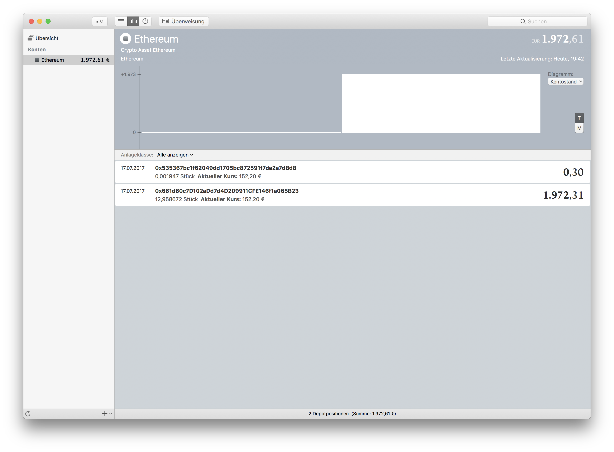
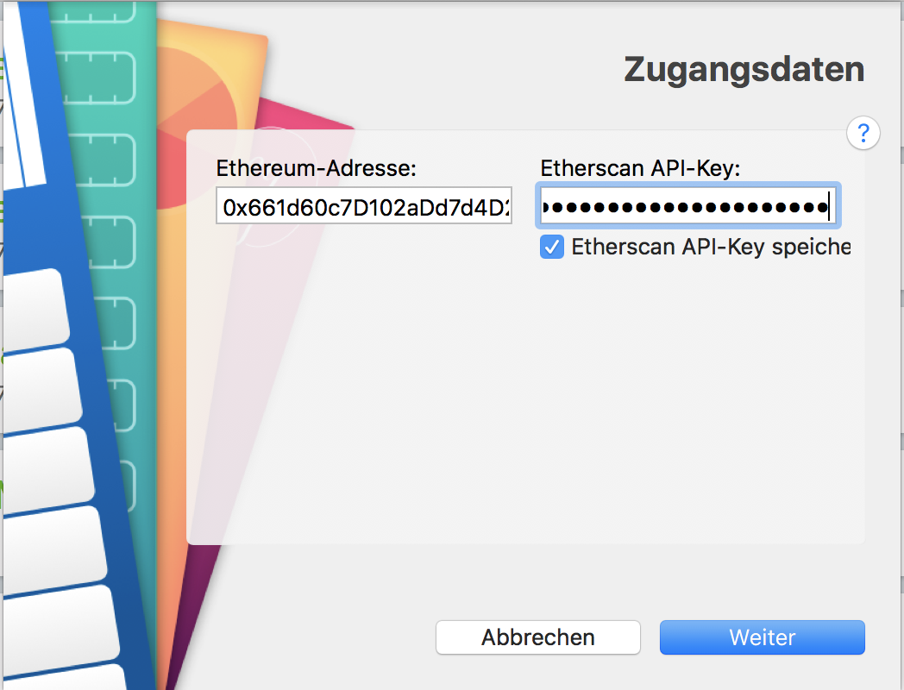

# Ethereum-MoneyMoney
Fetches amount and value of privately held Ethereum address via etherscan.io and returns it as a security.  
This can be also be used to track your cold storage.

## Extension Setup

You can get a signed version of this extension from

* my [GitHub releases page](https://github.com/Jacubeit/Ethereum-MoneyMoney/releases/tag/v0.1), or
* the [MoneyMoney Extensions](https://moneymoney-app.com/extensions/) page

Once downloaded, move `Ether.lua` to your MoneyMoney Extensions folder.

**Note:** This extension requires MoneyMoney **Version 2.2.18** or newer.

## Account Setup

### Etherscan

1. Setup an account on [etherscan.io](https://etherscan.io)
2. Go to `My API-Key | Developer`
3. Click on "Create Api Key" Button
4. Copy the Api-Key

### MoneyMoney

Add a new account (type "Ether").  
**Use your Ethererum adresses coma seperated as user name**  
`0x661d60c7D102aDd7d4D209911CFE146f1a065B23, 0x535367bc1f62049dd1705bc872591f7da2a7d8d8` (example)

**Use your API-Key as password**  
`ZDXKYDN63ZYM8HRZFF831XY6266FSA4NSB` (example)

